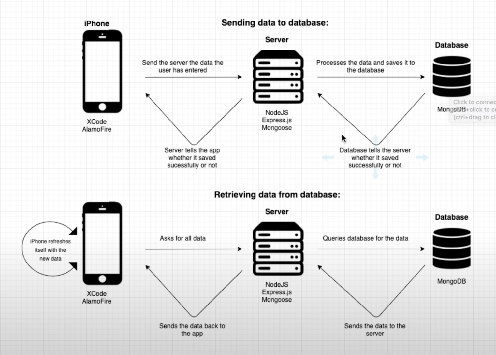

# Mongo-DB

## How to set up a Database and Web Server for an SwiftUI App

The actual database is not core data which is what you will usually expect for an App.

The XCode/Iphone app sending and retrieval configuration diagram: 

## Installation 

First install Homebrew (a free and open-source package management system that simplifies the installation of software on macOs operating system and Linux) in your terminal. 
- /bin/bash -c "$(curl -fsSL https://raw.githubusercontent.com/Homebrew/install/HEAD/install.sh)
Second make sure you have all your Xcode tools installed in your terminal.
- xcode-select  —install
Third install MongoDB in your terminal.
- brew tap mongodb/brew
- brew install mongodb-community@6.0
Fourth install Node.js in order to run Javascript 
- brew install node 
- To verify, type node -v 
Fifth open VSCode and create a new folder as well as a new file name server.js
- Open the integrated terminal in server.js and type npm init 
- Add “server” as the description 
- Enter yes for the next following prompts and the Package.json file will be created.
Sixth install Express.js with the following command
- npm install express
Seventh install mongoose
- npm install mongoose 

Create a schema file: locationSchema.js which will be used for all of our locations.

In server.js  import the following code below to create your server: 

 

Create routes to update database:

To connect to the server after importing the code, type “node server.js” in the open integrated terminal. 
To run MongoDb as a macOS service, issue the following in the Mac terminal: brew services start mongoldb-community@4.2 

Make sure to install Alamofire to your “Swift Packages - Add Package Dependency” in order to easily retrieve and send data your server:  https://github.com/Alamofire/Alamofire

Next create swift file in XCODE called APIFunctions and import the following code to send and receive data. 

Use newDB 
show collections 
db.datas.find()

***REMEMBER CANNOT RUN SERVER ON EXISTING SERVER.

Schema: Is an object that olds all of our data.
Test Server: Use Postman which allows us to send and request. 
Running Javascript outside browser: Node.js 
Express.js is used to create server and  runs inside of Node.js
Mongoose provides a straight-forward, schema-based solution to model your application data. It includes built-in type casting, validation, query building.
Node.js: An engine allowing you to run JavaScript 

PATH="/Users/kelvinkissi/opt/anaconda3/bin:$PATH"

echo 'eval "$(/opt/homebrew/bin/brew shellenv)"') >> /Users/kelvinkissi/.zprofile

eval "$(/opt/homebrew/bin/brew shellenv)"

To show data being saved in Mongo:
- Open terminal and type mongo
- Show dbs
- Use newDB
- db.datas.find() 

To find home-brew in Mac:
- Ls -la 
- Locate the .zshrc
- cat .zshrc  
- vim  .zshrc 

Npm - node package manager initializer, allows us to install other packages and dependencies.

